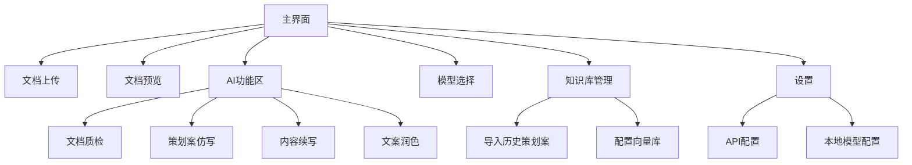

## 1. 产品概述
「游戏策划AI文档助手」是一款专为游戏策划人员设计的私有AI桌面工具，支持文档质检、逻辑漏洞检查、历史策划案仿写等功能。通过本地部署确保数据安全，同时提供多模型AI接入能力。

目标用户：游戏策划人员、游戏设计师、产品策划
核心价值：提升策划文档质量，减少逻辑漏洞，加速策划案创作过程

## 2. 核心功能

### 2.1 用户角色
| 角色 | 注册方式 | 核心权限 |
|------|----------|----------|
| 普通用户 | 本地使用，无需注册 | 文档上传、质检、仿写、模型切换 |
| 高级用户 | 本地配置文件 | 自定义模型参数、批量处理、知识库管理 |

### 2.2 功能模块
本软件包含以下主要功能模块：
1. **文档管理模块**：本地文档列表、拖拽上传、格式解析
2. **AI质检模块**：逻辑检查、漏洞识别、修改建议
3. **RAG仿写模块**：历史策划案知识库、智能仿写、模板生成
4. **模型管理模块**：多模型接入、一键切换、本地部署
5. **结果输出模块**：质检报告、仿写结果、导出功能

### 2.3 页面详情
| 页面名称 | 模块名称 | 功能描述 |
|----------|----------|----------|
| 主界面 | 左侧文档树 | 显示本地文件夹结构，支持文档分类管理 |
| 主界面 | 中间预览区 | 文档内容预览，支持docx/md/txt格式，保留章节结构 |
| 主界面 | 右侧AI功能区 | 质检、仿写、续写、润色功能按钮 |
| 主界面 | 模型选择器 | 下拉选择AI模型（豆包/DeepSeek/GPT-4o/Ollama） |
| 主界面 | 结果输出区 | 显示AI处理结果，支持复制、导出为文档 |
| 知识库管理 | 导入界面 | 批量导入历史策划案到向量库 |
| 知识库管理 | 配置界面 | 设置向量库参数、模型参数 |
| 设置页面 | API配置 | 配置各模型API密钥 |
| 设置页面 | 本地模型 | 配置Ollama本地模型路径和参数 |

## 3. 核心流程

### 3.1 文档质检流程
```
用户拖拽文档 → 系统解析文档 → 选择质检功能 → 选择AI模型 → 
系统分析文档 → 生成问题列表 → 显示修改建议 → 用户导出报告
```

### 3.2 历史策划案仿写流程
```
用户导入历史策划案 → 系统向量化存储 → 用户输入新需求 → 
选择仿写类型 → 系统检索相似案例 → AI生成新策划案 → 用户编辑完善
```

### 3.3 页面导航流程


## 4. 用户界面设计

### 4.1 设计风格
- **主色调**：深蓝色（#1890ff）+ 白色背景，营造专业感
- **按钮样式**：圆角矩形，悬停效果，主要操作为实心按钮
- **字体**：系统默认字体，标题16px，正文14px，注释12px
- **布局风格**：三栏式布局，左侧文档树、中间预览区、右侧功能区
- **图标风格**：简约线性图标，使用Element Plus图标库

### 4.2 页面设计概述
| 页面名称 | 模块名称 | UI元素 |
|----------|----------|----------|
| 主界面 | 左侧文档树 | 文件夹图标+文档名称，支持展开/折叠，拖拽排序，右键菜单 |
| 主界面 | 中间预览区 | 文档内容渲染，章节标题突出显示，支持滚动和缩放 |
| 主界面 | 右侧功能区 | 功能按钮分组排列，模型选择下拉框，结果输出文本框 |
| 主界面 | 状态栏 | 显示当前文档、模型状态、处理进度 |
| 知识库管理 | 导入界面 | 文件选择器、进度条、导入状态提示 |
| 设置页面 | API配置 | 输入框+测试按钮，密钥加密显示 |

### 4.3 响应式设计
- **桌面优先**：针对24寸以上显示器优化，支持窗口大小调整
- **最小窗口**：1280x720，确保功能完整显示
- **拖拽支持**：支持文件拖拽到任意区域上传
- **快捷键**：Ctrl+O打开文件，Ctrl+S保存结果，Ctrl+Q快速质检

### 4.4 交互设计
- **加载状态**：骨架屏+进度条，避免界面卡顿
- **错误提示**：顶部通知栏+详细错误日志
- **成功反馈**：绿色勾选动画+提示音
- **操作确认**：重要操作需要二次确认对话框