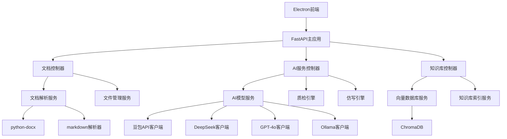

## 1. 架构设计

```mermaid
erDiagram
    DOCUMENT ||--o{ DOCUMENT_VERSION : contains
    DOCUMENT ||--o{ QUALITY_CHECK : has
    DOCUMENT ||--o{ IMITATION_RESULT : generates
    KNOWLEDGE_BASE ||--o{ DOCUMENT : references
    KNOWLEDGE_BASE ||--o{ VECTOR_EMBEDDING : contains
    
    DOCUMENT {
        string id PK
        string filename
        string type
        string content
        json structure
        datetime created_at
        datetime updated_at
    }
    
    DOCUMENT_VERSION {
        string id PK
        string doc_id FK
        string version
        string content
        datetime created_at
    }
    
    QUALITY_CHECK {
        string id PK
        string doc_id FK
        string model_name
        json issues
        int score
        datetime checked_at
    }
    
    IMITATION_RESULT {
        string id PK
        string doc_id FK
        string type
        string generated_content
        json references
        datetime
```

## 2. 技术栈描述

* **前端框架**：Electron\@27 + Vue3\@3.3 + Element Plus\@2.4

* **初始化工具**：vite-init

* **后端框架**：Python\@3.9 + FastAPI\@0.104

* **文档解析**：python-docx\@1.1 + markdown\@3.5 + python-multipart\@0.0.6

* **AI集成**：LangChain\@0.1 + ChromaDB\@0.4 + transformers\@4.36

* **向量库**：Chroma本地向量数据库

* **打包工具**：electron-builder\@24.6

## 3. 路由定义

| 路由         | 用途              |
| ---------- | --------------- |
| /          | 主界面，三栏式布局       |
| /settings  | 设置页面，API配置和模型参数 |
| /knowledge | 知识库管理，导入和配置     |
| /preview   | 文档预览页面          |
| /results   | 结果展示页面          |

## 4. API定义

### 4.1 文档处理API

**上传文档**

```
POST /api/documents/upload
```

请求参数：

| 参数名  | 类型     | 必需 | 描述                 |
| ---- | ------ | -- | ------------------ |
| file | File   | 是  | 文档文件（docx/md/txt）  |
| type | string | 是  | 文档类型：docx, md, txt |

响应：

```json
{
  "success": true,
  "data": {
    "id": "doc_123",
    "filename": "策划案.docx",
    "content": "文档纯文本内容",
    "structure": ["章节1", "章节2"]
  }
}
```

**文档质检**

```
POST /api/documents/quality-check
```

请求参数：

| 参数名     | 类型     | 必需 | 描述     |
| ------- | ------ | -- | ------ |
| doc\_id | string | 是  | 文档ID   |
| model   | string | 是  | AI模型名称 |

响应：

```json
{
  "success": true,
  "data": {
    "issues": [
      {
        "type": "逻辑矛盾",
        "location": "第3章第2节",
        "description": "奖励规则与限制条件冲突",
        "suggestion": "建议统一奖励获取条件"
      }
    ],
    "score": 85
  }
}
```

**策划案仿写**

```
POST /api/documents/imitate
```

请求参数：

| 参数名          | 类型     | 必需 | 描述            |
| ------------ | ------ | -- | ------------- |
| requirements | string | 是  | 新策划需求描述       |
| type         | string | 是  | 策划类型：活动/系统/需求 |
| model        | string | 是  | AI模型名称        |

响应：

```json
{
  "success": true,
  "data": {
    "generated_content": "生成的策划案内容",
    "references": ["参考案例1", "参考案例2"]
  }
}
```

### 4.2 知识库管理API

**导入历史策划案**

```
POST /api/knowledge/import
```

请求参数：

| 参数名      | 类型      | 必需 | 描述          |
| -------- | ------- | -- | ----------- |
| files    | File\[] | 是  | 历史策划案文件数组   |
| category | string  | 是  | 分类：活动/系统/需求 |

响应：

```json
{
  "success": true,
  "data": {
    "imported_count": 10,
    "failed_files": []
  }
}
```

**搜索相似案例**

```
POST /api/knowledge/search
```

请求参数：

| 参数名   | 类型     | 必需 | 描述         |
| ----- | ------ | -- | ---------- |
| query | string | 是  | 搜索查询       |
| limit | int    | 否  | 返回结果数量，默认5 |

响应：

```json
{
  "success": true,
  "data": {
    "results": [
      {
        "id": "case_123",
        "title": "春节活动策划",
        "similarity": 0.89,
        "excerpt": "活动内容简介..."
      }
    ]
  }
}
```

### 4.3 模型管理API

**获取可用模型**

```
GET /api/models/available
```

响应：

```json
{
  "success": true,
  "data": {
    "models": [
      {
        "name": "豆包",
        "type": "cloud",
        "available": true
      },
      {
        "name": "Ollama",
        "type": "local",
        "available": true
      }
    ]
  }
}
```

**测试模型连接**

```
POST /api/models/test
```

请求参数：

| 参数名    | 类型     | 必需 | 描述     |
| ------ | ------ | -- | ------ |
| model  | string | 是  | 模型名称   |
| config | object | 是  | 模型配置参数 |

## 5. 服务器架构图



## 6. 数据模型

### 6.1 数据模型定义

```mermaid
erDiagram
    DOCUMENT ||--o{ DOCUMENT_VERSION : contains
    DOCUMENT ||--o{ QUALITY_CHECK : has
    DOCUMENT ||--o{ IMITATION_RESULT : generates
    KNOWLEDGE_BASE ||--o{ DOCUMENT : references
    KNOWLEDGE_BASE ||--o{ VECTOR_EMBEDDING : contains
    
    DOCUMENT {
        string id PK
        string filename
        string type
        string content
        json structure
        datetime created_at
        datetime updated_at
    }
    
    DOCUMENT_VERSION {
        string id PK
        string doc_id FK
        string version
        string content
        datetime created_at
    }
    
    QUALITY_CHECK {
        string id PK
        string doc_id FK
        string model_name
        json issues
        int score
        datetime checked_at
    }
    
    IMITATION_RESULT {
        string id PK
        string doc_id FK
        string type
        string generated_content
        json references
        datetime
```

